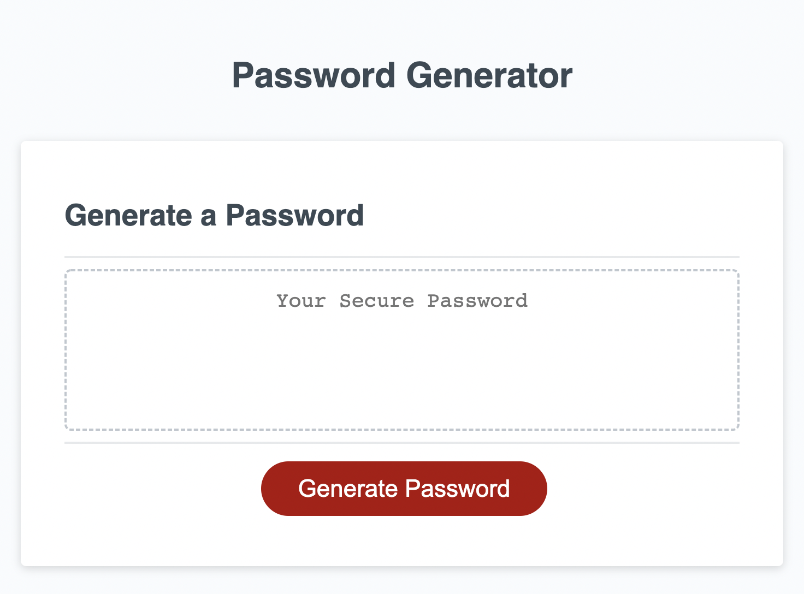
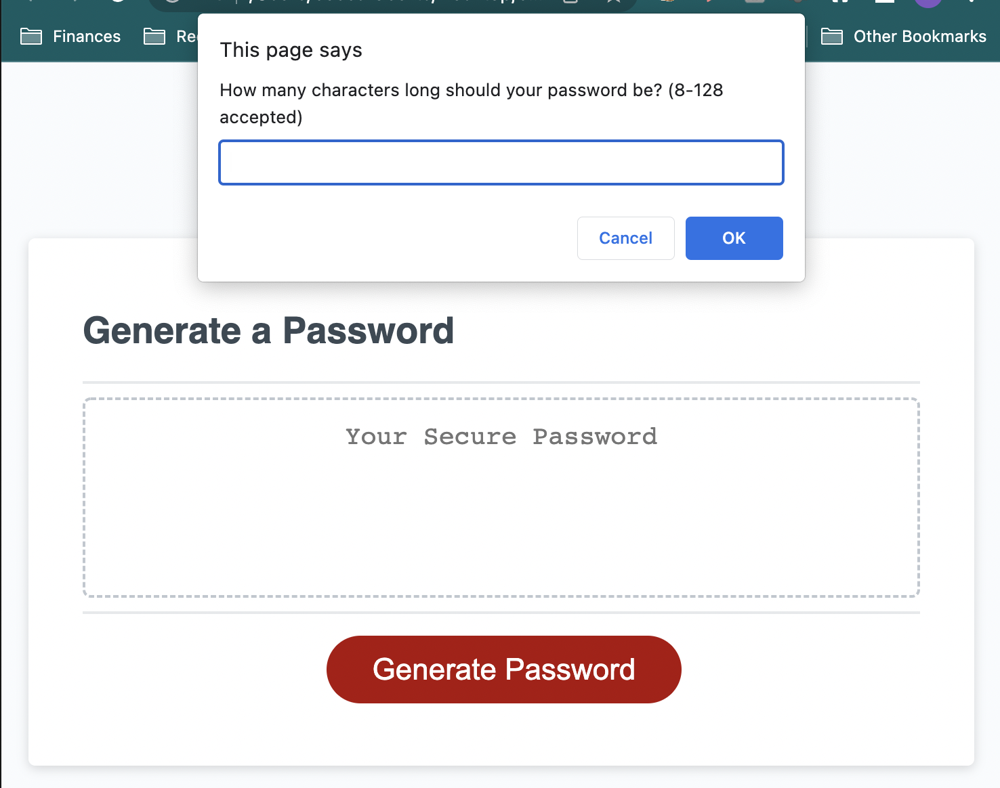
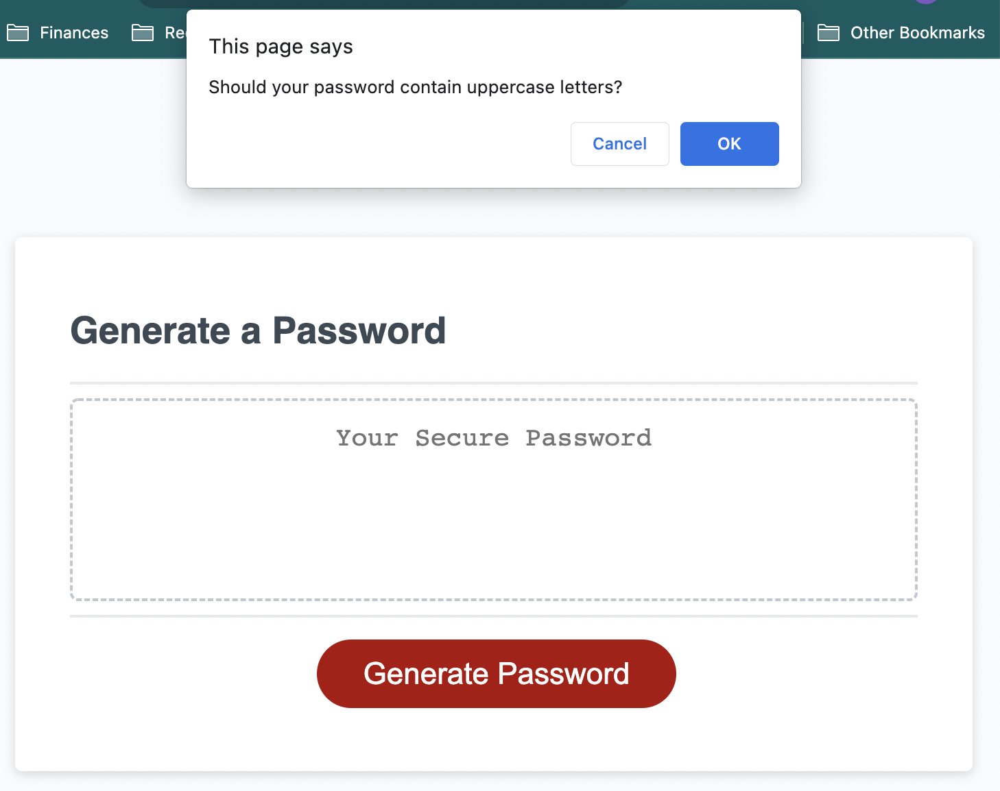
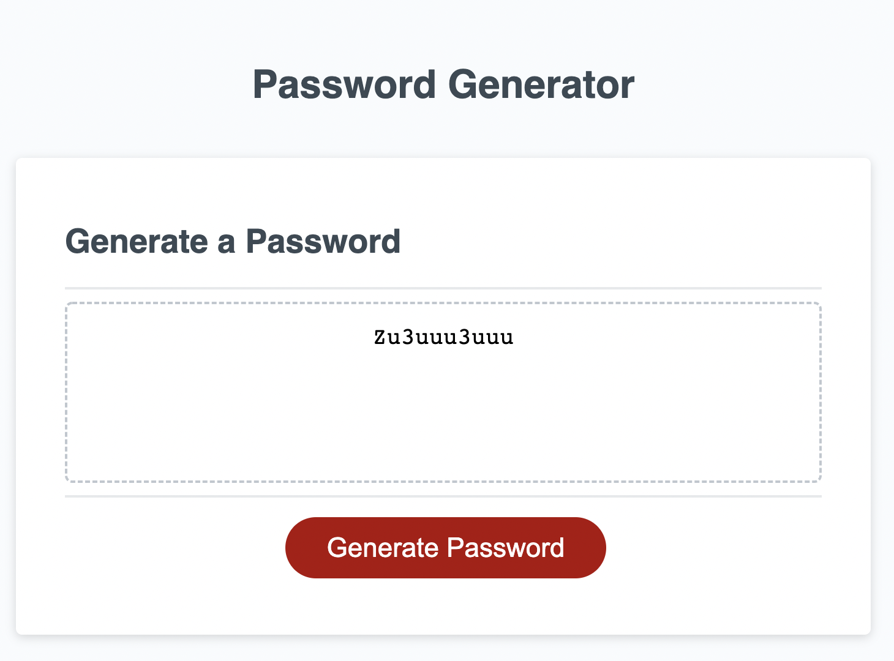

# password-generator-js

## About

This is a web application designed to generate strong, randomized passwords based on user inputs for improved security. Users may select a password length within a given range (8-128 characters) as well as whether or not to use uppercase letters, lowercase letters, numbers, or special characters in their passwords.

## Starting Screen

## Prompt for Password Length

## Prompt for Character Type Use

## Final Display

## Deployed Application Link

(coming soon!)
